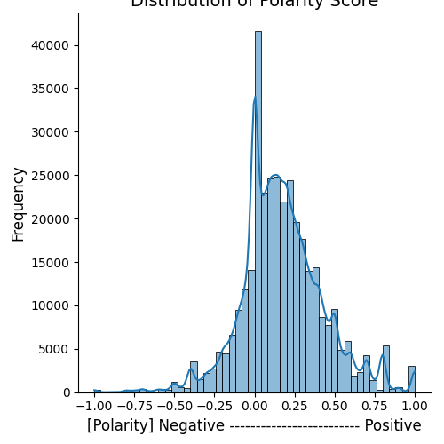
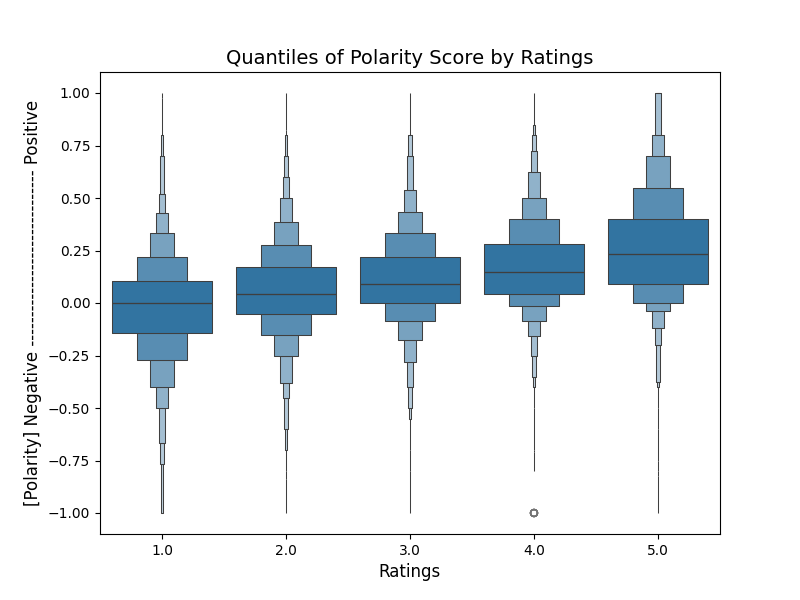
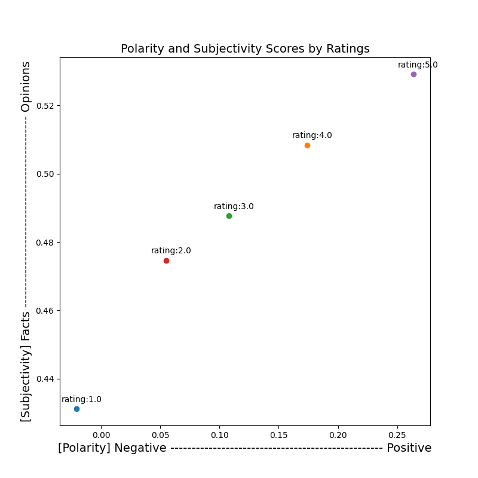

# Sentiment Analysis of Amazon Video Game Reviews: Predicting Customer Satisfaction

## Introduction
Our project analyzes over 1.7 million Amazon video game reviews to build a model that predicts customer satisfaction based on review sentiments. We categorize reviews as negative (1 to 3 stars) or positive (4 to 5 stars) and apply text analysis techniques such as tokenization and TF-IDF.

We use logistic regression and naive Bayes models, chosen for their efficiency with binary outcomes. These models are trained and tested using metrics like precision, recall, F1 score, and AUC, aiming to accurately reflect and predict customer sentiment. The goal is to link these sentiments to actual product ratings, providing insights that can help sellers adjust their strategies and better engage with customers. This work aims to demonstrate the tangible impact of sentiment on customer satisfaction in e-commerce.

## Data Source
For our sentiment analysis, we utilized the Amazon Reviews dataset available from the UCSD Datasets page. Specifically, we focused on the Video Games category, which features a comprehensive collection of user reviews and associated product metadata. This dataset includes data up to the year 2023 and contains approximately 1.7 million user reviews.

The dataset is organized into two primary types: user reviews and product metadata, which are linked using the ASIN product identifier. By merging these two datasets, we created a unified dataset that is ideal for conducting detailed sentiment analysis and big data tasks.

You can access the dataset and learn more about it here: [UCSD Datasets - Amazon Reviews](https://cseweb.ucsd.edu/~jmcauley/datasets.html#amazon_reviews)

Additionally, the preprocessed version of this dataset is stored and accessible in an AWS S3 bucket.
Preprocessed data can be accessed at the following S3 location:
```plaintext
aws s3 cp s3://preprocessedreviewdata/part-00000-5eaf89fa-75fc-4633-ab39-87d2a8214a9e-c000.json <your_local_path>
```

#### Prerequisites
- Python: Version 3.6 or newer.
- Apache Spark: Spark 3.0 or newer is required to handle large-scale data processing.
- Java: Java 8 or 11, required for running Spark.
- NLTK: The Natural Language Toolkit for Python, used for text processing.
- Pandas: For handling data manipulation in Python UDFs.
- Scikit-learn: Necessary for implementing the logistic regression model.
- NumPy: For numerical operations.
- Additional Python Libraries: re for regular expressions, pandas_udf from PySpark.

#### Installation Steps
1. **Install Python**: Ensure Python 3.8+ is installed on your system.
2. **Install Java**: Java is needed to run Spark, install either version 8 or 11.
3. **Download and Set Up Apache Spark**: Download Spark from the Apache website and configure it on your machine.
4. **Set up Python Libraries**: Install the required Python libraries using pip:
```bash
pip install nltk pandas pyspark scikit-learn numpy
```

## Data Preprocessing

The primary goal of preprocessing in our project was to refine the data from Amazon's reviews for sentiment analysis, specifically focusing on video games and beauty products. This step is crucial to enhance the quality and effectiveness of our analysis by cleaning and transforming the text data.

#### Process Overview
After loading user reviews and product metadata from JSONL files into separate Spark DataFrames, we first addressed conflicts in column names (e.g., both DataFrames had 'title' and 'images' columns). To resolve these, we renamed them to 'review_title', 'meta_title', and 'meta_images' for clarity.

We merged the reviews DataFrame with the metadata DataFrame using the 'parent_asin' column, enriching the review data with corresponding product metadata. This merging is essential for creating a richer feature set for our models.

The preprocessing steps included converting text to lowercase, removing non-alphanumeric characters, tokenizing the text, and removing common stop words. These steps are implemented in a custom script, `Preprocess.py`, which is designed to run efficiently on large datasets using Apache Spark.

#### Usage
- **Script Execution**: To preprocess the data, run the Preprocess.py script. This script will perform all necessary preprocessing steps on the dataset and prepare it for sentiment analysis.
#### Example
- **Running the Preprocessing Script**:
```bash
spark-submit --executor-memory 8G --driver-memory 4G Preprocess.py
```
This command will execute the Preprocess.py script using Spark, which preprocesses the Amazon reviews data according to the defined schema and text processing functions described in the script.

## Exploratory Data Analysis (EDA) - Label Distribution Analysis

The `Label_Distribution_Analysis.py` script conducts a exploratory data analysis on video game review data. This script is important for understanding the underlying patterns and distributions in the sentiment and subjectivity of the text data.

### Overview
This script processes the review data stored in JSON format, using Apache Spark for scalable data operations. It leverages TextBlob for sentiment and subjectivity analysis and employs visualization libraries like Matplotlib and Seaborn.

### Key Features
- **Sentiment and Subjectivity Analysis**: The script calculates the polarity and subjectivity of each review using TextBlob, a simple NLP tool ideal for these tasks.
- **Data Visualization**: It generates various plots such as histograms, box plots, and scatter plots to visualize the distribution of polarity scores, subjectivity, and their relationship with user ratings.
- **Label Distribution**: Based on the polarity scores and user ratings, the script dynamically labels reviews as 'Positive' or 'Negative'. It also provides a count of reviews by sentiment label to analyze class balance.
- **Word Frequency Analysis**: For both positive and negative sentiments, the script identifies and displays the top 20 frequent words, aiding in the understanding of common themes and expressions used in different sentiment contexts.

### Example Output

#### Polarity and Subjectivity Distribution Plot:




#### Descriptive Statistics Output:
```plaintext
Descriptive Statistics by Rating:
           count      mean       std  min     25%     50%     75%  max
rating                                                                
1.0      52750.0 -0.020689  0.243912 -1.0 -0.1429  0.0000  0.1052  1.0
2.0      26885.0  0.055138  0.216543 -1.0 -0.0533  0.0441  0.1722  1.0
3.0      36181.0  0.108034  0.211177 -1.0  0.0000  0.0924  0.2188  1.0
4.0      57386.0  0.173988  0.205374 -1.0  0.0433  0.1500  0.2800  1.0
5.0     174825.0  0.263689  0.250348 -1.0  0.0917  0.2333  0.4000  1.0

Quantiles for Each Rating:
rating      
1.0     0.25   -0.1429
        0.50    0.0000
        0.75    0.1052
2.0     0.25   -0.0533
        0.50    0.0441
        0.75    0.1722
3.0     0.25    0.0000
        0.50    0.0924
        0.75    0.2188
4.0     0.25    0.0433
        0.50    0.1500
        0.75    0.2800
5.0     0.25    0.0917
        0.50    0.2333
        0.75    0.4000
```

## Sentiment Trend Analysis

The `SentimentTrendPlottingAllFilesVideoGames.py` script provides an in-depth exploration and visualization of sentiment trends over time across video game reviews. This script uses the Plotly library to create interactive line plots that display changes in sentiment on a monthly and quarterly basis.

### Key Features
- **Time Series Analysis**: Converts Unix timestamps to standard datetime formats and aggregates data to illustrate sentiment trends over months and quarters.
- **Interactive Visualizations**: Creates responsive, interactive visualizations using Plotly, which allows users to observe sentiment trends and explore specific time periods in detail.

#### Example
- **Running the Script**:
```bash
python SentimentTrendPlottingAllFilesVideoGames.py
```

### Example Output


## Logistic Regression Model
The Logistic_Regression.py script uses logistic regression, an effective method for binary classification tasks like sentiment analysis of product reviews. In our project, reviews are labeled as positive or negative based on their star ratings. The script converts text into numerical data using TF-IDF (Term Frequency-Inverse Document Frequency), which helps emphasize important words and downplay the less informative ones that frequently occur.

To tackle the issue of class imbalance common in review data, the script includes a step to oversample the minority class (negative reviews). This approach helps balance the dataset, enhancing the model's ability to perform well across different classes. The logistic regression model's performance is measured using several metrics including Precision, Recall, F1 Score, and AUC.

#### Usage
To run the logistic regression model, execute the Logistic_Regression.py script from the command line. This script will read the preprocessed data, apply the logistic regression model, and output the classification results along with performance metrics.

#### Example
- **Running the Script**:
```bash
python Logistic_Regression.py
```
This will start the classification process using the logistic regression model. The output will include accuracy metrics such as precision, recall, and F1-score, which help evaluate the effectiveness of the model in classifying the sentiment of the reviews.

#### Sample Output:
```plaintext
+-----+-------+
|label|  count|
+-----+-------+
|    1|1262443|
|    0|1262148|
+-----+-------+

Test Accuracy: 0.9072718979253643
```
This table shows the balanced distribution of labels in the dataset, indicating effective handling of class imbalance through oversampling. The '1' label indicates positive reviews, while the '0' label indicates negative reviews. The close counts of both labels show that the dataset has been balanced effectively.
```
Label: 1, Prediction: 0.0, Probability: [0.6006160931251585,0.3993839068748415]
Label: 1, Prediction: 0.0, Probability: [0.6006160931251585,0.3993839068748415]
Label: 1, Prediction: 0.0, Probability: [0.6006160931251585,0.3993839068748415]
```
These lines demonstrate individual predictions made by the model. Each entry shows the true label, the prediction made by the model, and the probability distribution between the classes. The probability values indicate how the model quantifies its decisions.

## Linear SVM Model

The `Linear_SVM.py` script applies a Linear Support Vector Machine (SVM), a powerful method for binary classification tasks, particularly suited to high-dimensional data such as text. This script is part of our sentiment analysis project where reviews are classified as positive or negative. The classification relies on transforming review text into numerical vectors using TF-IDF (Term Frequency-Inverse Document Frequency), which highlights significant terms while minimizing the influence of frequent but less informative terms. The performance of the Linear SVM model is evaluated using key metrics including Precision, Recall, F1 Score, and AUC.

### Usage
To run the Linear SVM model, execute the `Linear_SVM.py` script. This script processes the preprocessed data, applies the Linear SVM model, and outputs the classification results along with performance metrics.

### Example
- **Running the Script**:
```bash
python Linear_SVM.py
```
This command triggers the classification process using the Linear SVM model. The results displayed include key performance metrics such as Precision, Recall, and F1-Score.

#### Sample Output

The `Linear_SVM.py` script classifies reviews into 'Positive' or 'Negative' sentiments based on the text's sentiment score derived from ratings and TextBlob analysis. Below is a sample of the output produced by the script, showing the sentiment classification alongside the original ratings and computed sentiment attributes:

```plaintext
+------+--------------------+--------+------------+---------------+---------+
|rating|                text|polarity|subjectivity|sentiment_score|sentiment|
+------+--------------------+--------+------------+---------------+---------+
|   1.0|    came usb connect|     0.0|         0.0|              0| Negative|
|   4.0|quality pretty go...|    0.25|         0.8|              1| Positive|
|   5.0|                    |     0.0|         0.0|              1| Positive|
|   2.0|know near end cur...|  0.1829|      0.3921|              0| Negative|
|   5.0|update downloaded...|   0.282|      0.5562|              1| Positive|
|   1.0|satisfied happy t...|    0.65|         1.0|              0| Negative|
|   4.0|charge last long ...|    0.25|      0.4056|              1| Positive|
+------+--------------------+--------+------------+---------------+---------+
```
The model's performance is evaluated on several key metrics:
```plaintext
Accuracy: 0.8694
Precision: 0.8697
Recall: 0.8694
F1 Score: 0.8694
AUC: 0.9353
```

## Naive Bayes Model
The `Naive_Bayes.py` script employs the Naive Bayes classifier, a popular probabilistic model well-suited for binary classification tasks in text analytics. 

### Overview
The script processes text data by transforming it into numerical features using a combination of tokenization, HashingTF, and IDF (Inverse Document Frequency) transformations. The Naive Bayes model is particularly effective in this context due to its assumption of independence between features, making it adept at handling text data.

### Usage
To execute the Naive Bayes model script, run the following command in the terminal:

```bash
python Naive_Bayes.py <data_path> <output_dir>
```
This command requires two arguments:
- <data_path>: The path to the input data in JSON format.
- <output_dir>: The directory where the output metrics will be saved.

#### Sample Output
```plaintext
Label: 1, Prediction: 1.0, Probability: [0.49991837115469817,0.5000816288453018]
Label: 1, Prediction: 1.0, Probability: [0.49991837115469817,0.5000816288453018]
Label: 1, Prediction: 1.0, Probability: [0.49991837115469817,0.5000816288453018]
```
```plaintext
Accuracy: 0.5090
Precision: 0.8045
Recall: 0.8032
F1 Score: 0.8011
AUC: 0.5632
```


